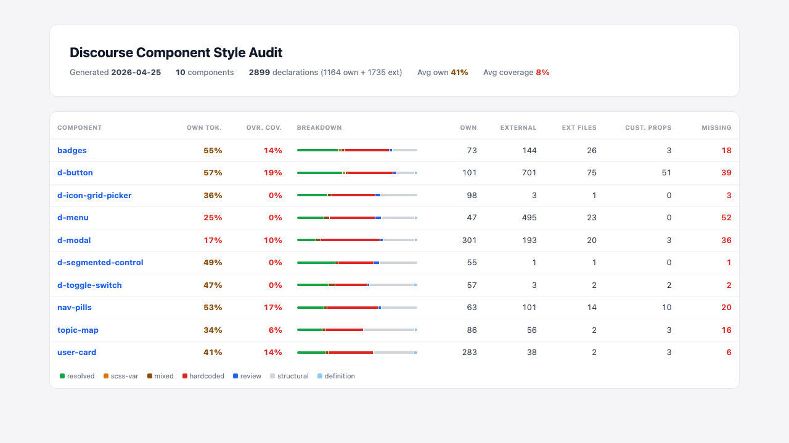
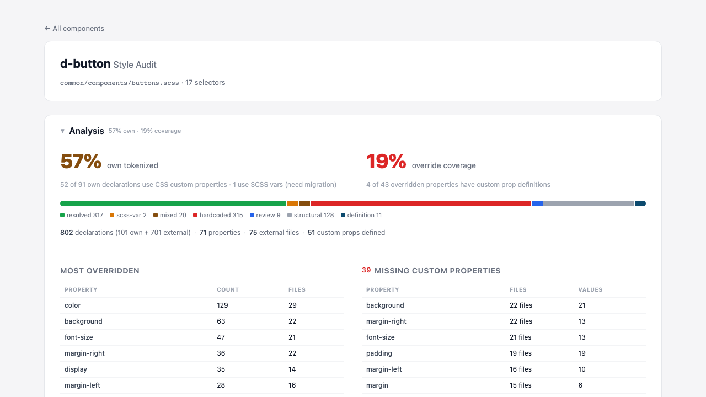

# discourse-component-audit

AST-based SCSS audit tool for Discourse UI kit candidate components. Parses every SCSS file with PostCSS, resolves nested selectors, and produces a complete inventory of how each component is styled — own declarations, external overrides, tokenization coverage, and missing custom properties.

Built to guide tokenization and override cleanup as we refine the UI kit library's styling.

## Screenshots

**Index — all components at a glance**



**Component detail — d-button**



## Usage

```bash
npm run audit                                    # all components
node src/index.mjs --component d-button          # single component
node src/index.mjs --discourse-path ../discourse  # custom Discourse path
node src/index.mjs --output ./reports             # custom output dir
```

Reports are generated in `dist/` as HTML + JSON per component, plus an `index.html` overview.

## Components

badges, d-button, d-icon-grid-picker, d-menu, d-modal, d-segmented-control, d-toggle-switch, nav-pills, topic-map, user-card

## How It Works

```
Component JSON (components/*.json)
  -> Parse all SCSS files (PostCSS + postcss-scss, no compilation)
  -> Walk AST: extract every declaration with resolved selector + value classification
  -> Match resolved selectors against component identity selectors
  -> Partition into own vs external
  -> Compute analysis metrics
  -> Generate HTML + JSON reports
```

Each component is defined by a JSON manifest:

```json
{
  "name": "d-modal",
  "slug": "d-modal",
  "primaryFiles": ["common/base/modal.scss", "common/modal/modal-overrides.scss"],
  "identitySelectors": [".d-modal", ".d-modal__container", ".d-modal__header"],
  "cssCustomPropertyPrefixes": ["--modal-"]
}
```

| Field | Purpose |
|---|---|
| `primaryFiles` | SCSS files that define the component (relative to stylesheets root). Declarations here are **own**. |
| `identitySelectors` | Selectors that identify this component. Rules targeting these from other files are **external**. |
| `cssCustomPropertyPrefixes` | Prefixes for matching `:root` custom property definitions to this component. |

## Concern Levels

Every declaration gets a concern level based on its property and value:

| Level | Meaning |
|---|---|
| **resolved** | Uses CSS custom properties (`var(--x)`). Ready. |
| **scss-var** | Uses SCSS variables (`$x`). Needs migration. |
| **mixed** | Variable + hardcoded literal combined. |
| **hardcoded** | Themeable property with a literal value. Needs tokenization. |
| **structural** | Layout/behavior property (display, position, etc.). Fine as-is. |
| **definition** | CSS custom property being defined. Informational. |
| **review** | calc/function without variables. Case-by-case. |

## Metrics

- **Own Tokenized %** — percentage of own themeable declarations using CSS custom properties. Only `var(--x)` counts; SCSS variables are flagged separately.
- **Override Coverage %** — percentage of externally overridden themeable properties with a corresponding custom property definition. Weighted by file count.

## Source Files

| File | Purpose |
|---|---|
| `src/index.mjs` | CLI entry, orchestration |
| `src/scanner.mjs` | PostCSS AST walker — extracts declarations with resolved selectors |
| `src/resolver.mjs` | Resolves nested SCSS selectors (`&` expansion, comma multiplication) |
| `src/classifier.mjs` | Classifies values and determines concern levels |
| `src/matcher.mjs` | Matches resolved selectors to component identity selectors |
| `src/reporter.mjs` | JSON + HTML report generation with analysis metrics |

## Future: Token Manifests and Enforcement

The audit is step one. The end goal is that each component manifest declares a **tokens** array — the full list of CSS custom properties that external code is allowed to set:

```json
{
  "tokens": [
    "--d-modal-padding-block",
    "--d-modal-padding-inline",
    "--d-modal-border-radius",
    "--d-modal-max-width"
  ]
}
```

External code customizes components through tokens, not direct property overrides. Enforcement is planned as a stylelint plugin (`ui-kit/no-direct-override`).
